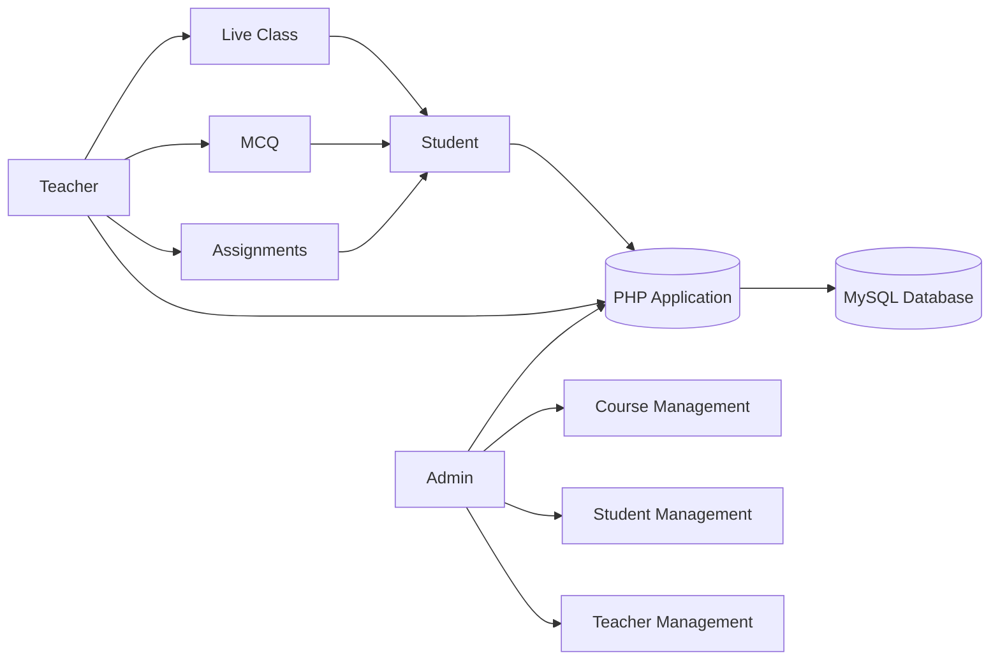

<div align="center">

# 🎓 Virtual Varsity

### A Modern Role-Based Learning Management System (LMS)

Build • Learn • Teach • Manage

<p>

[](https://virtualvarsity.freedev.app/)


</p>

---

### 🌐 Live Demo

## https://virtualvarsity.freedev.app/

</div>

---

# 📖 About

**Virtual Varsity** is a complete Learning Management System (LMS) built with **PHP, MySQL, JavaScript and Tailwind CSS**.

The platform provides separate dashboards for **Admin**, **Teacher**, and **Student**, making online education management simple and efficient.

It includes:

- 🎥 Live Classes
- ✅ Smart Attendance
- 📝 Live MCQ Exams
- 📄 Assignment Submission
- 📊 CGPA Tracking
- 📚 Course Management
- 👨‍🏫 Faculty Management
- 👨‍🎓 Student Portal

---

# 📱 Responsive Preview

| Desktop | Tablet | Mobile |
| ------- | ------ | ------ |
| ✅      | ✅     | ✅     |

---

# 📸 Screenshots

> Replace these placeholders with actual screenshots.

## 🏠 Home Page

```
assets/screenshots/home.png
```


---

## 👨‍💼 Admin Dashboard


---

## 👨‍🏫 Teacher Dashboard


---

## 👨‍🎓 Student Dashboard


---

# 🎥 Demo GIF

> Add a screen recording here.

```
assets/demo.gif
```


---

# ✨ Features

## 👨‍💼 Admin

- 👨‍🎓 Student Management
- 👨‍🏫 Teacher Management
- 📚 Course Management
- 📈 GPA Management
- 🎓 Semester Promotion
- 🗃 Student Archive
- 📋 Enrollment Management
- 📊 Academic Records

---

## 👨‍🏫 Teacher

- 🎥 Start Live Class
- 🔑 Attendance Token
- 📝 Live MCQ
- 📄 PDF Assignment
- 📥 Export MCQ PDF
- 📊 View Student Performance
- 🗂 Archive MCQs

---

## 👨‍🎓 Student

- 📚 Enrolled Courses
- 🎥 Join Live Classes
- ✅ Attendance Verification
- 📝 MCQ Participation
- 📄 PDF Submission
- 📊 Attendance Report
- 🎓 CGPA View

---

# 🏗️ System Architecture



---

# 🧩 Modules

```
Authentication
│
├── Admin Portal
├── Teacher Portal
└── Student Portal

Academic
│
├── Courses
├── GPA
├── CGPA
└── Attendance

Assessment
│
├── Live MCQ
├── PDF Assignment
└── Quiz Submission

Administration
│
├── Users
├── Teachers
├── Students
└── Reports
```

---

# 🛠 Tech Stack

| Technology   | Used |
| ------------ | ---- |
| PHP          | ✅   |
| MySQL        | ✅   |
| Tailwind CSS | ✅   |
| JavaScript   | ✅   |
| HTML5        | ✅   |
| CSS3         | ✅   |
| mPDF         | ✅   |

---

# 📂 Project Structure

```
Virtual-Varsity
│
├── admin_dashboard.php
├── teacher_dashboard.php
├── student_dashboard.php
├── index.php
├── db.php
├── attendance_helpers.php
├── generate_mcq_pdf.php
├── get_live_classes.php
├── live_status.php
├── start_attendance.php
├── uploads/
├── vendor/
├── composer.json
└── README.md
```

---

# ⚙️ Installation

## Clone

```bash
git clone https://github.com/yourusername/virtual-varsity.git
```

---

## Enter Project

```bash
cd virtual-varsity
```

---

## Install Composer Packages

```bash
composer install
```

---

## Create Database

```
virtual_university
```

---

## Configure Database

Edit

```
db.php
```

---

## Generate Tables

Run

```
fresh_setup.php
```

or

```
http://localhost/virtual-varsity/fresh_setup.php
```

---

## Start Project

```
http://localhost/virtual-varsity/
```

---

# 👥 User Roles

| Role       | Access                         |
| ---------- | ------------------------------ |
| 👨‍💼 Admin   | Full Control                   |
| 👨‍🏫 Teacher | Course & Live Class Management |
| 👨‍🎓 Student | Learning Portal                |

---

# 📦 Dependencies

```json
{
  "mpdf/mpdf": "^8.3"
}
```

Install manually

```bash
composer require mpdf/mpdf
```

---

# 🚀 Upcoming Features

- 🔔 Notifications
- 📧 Email Verification
- 🔑 Password Reset
- 📱 Progressive Web App
- 💬 Live Chat
- 📹 Video Recording
- 📊 Analytics Dashboard
- 🌙 Dark Mode
- 📡 REST API
- 📲 Android App

---

# 🤝 Contributing

```bash
Fork 🍴

↓

Create Branch 🌿

↓

Commit Changes 💻

↓

Push 🚀

↓

Create Pull Request 🎉
```

---

# ⭐ Support

If you like this project,

## ⭐ Star this Repository

It helps others discover the project.

---

# 📜 License

Distributed under the **MIT License**.

---

<div align="center">

## 👨‍💻 Developed By

**Your Name**

🌐 https://github.com/yourusername

---

### ⭐ Thanks for visiting ⭐

Made with ❤️ using PHP & Tailwind CSS

</div>
